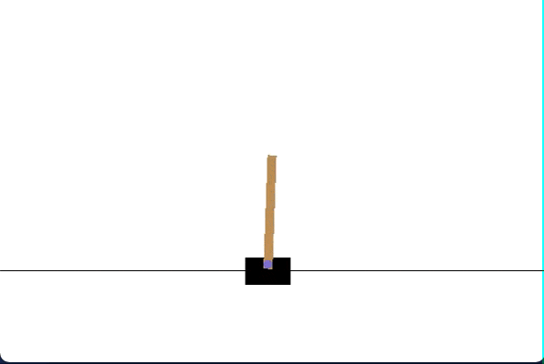

# Cartpole-v1

https://gym.openai.com/envs/CartPole-v1/

The goal of this project is to keep the pole attached to a cart standing up as long as possible.



To do so, you can send actions to the cart to help it move and try to control better the position of the pole.

I used the Bellman Equation to do so, saving my qvalues in a qtable. I also did it with a neural network instead of a qtable.

```python tabledeq.py```
```python neural_network.py```

Please use the option --help to see the diferent arguments you can add.
